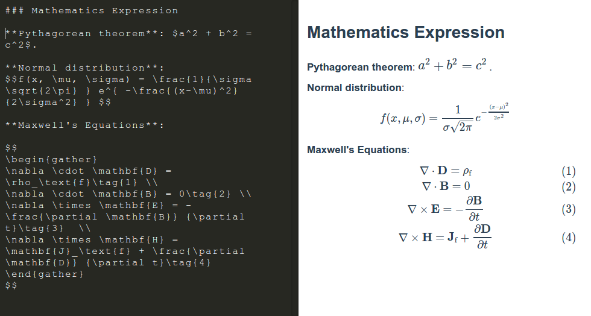
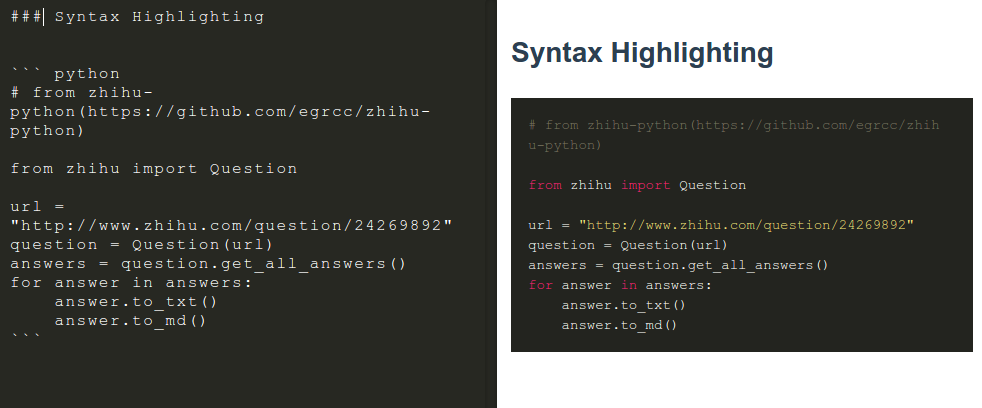
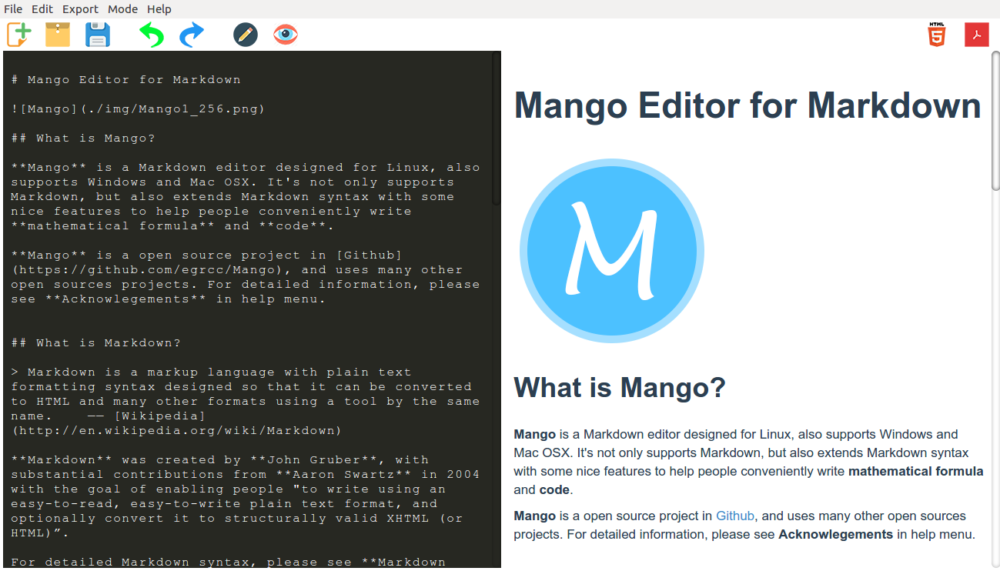
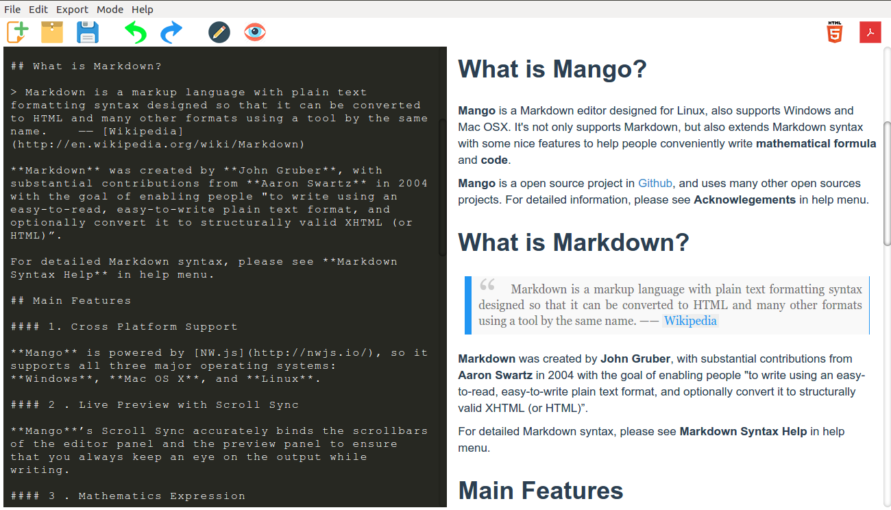
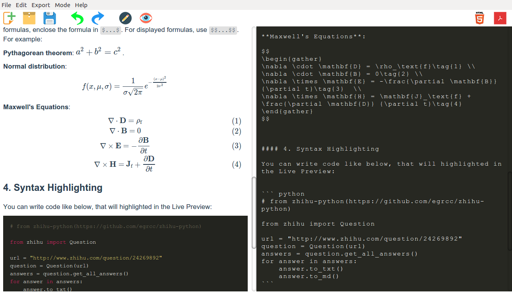
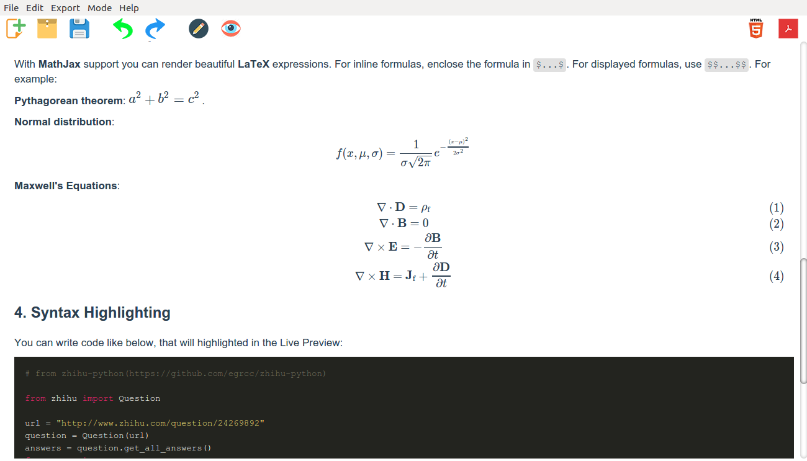

# Mango 编辑器

## 介绍

**Mango** 是一个专为 Linux 平台而设计的 Markdown 编辑器，同时也支持 Windows 和 Mac OSX。由于我在 Linux 平台始终没有找到一款令我满意的 Markdown 编辑器，所以花了一个多星期的时间用 NW.js 实现了 Mango，[这里](http://egrcc.github.io/2015/04/12/mango-tutorial/)有我写的文章，简要介绍了我实现 Mango 的过程及原理。

## 主要特性

#### 1. 跨平台支持

**Mango** 由 [NW.js](http://nwjs.io/) 驱动，所以天然支持 **Windows**， **Mac OS X** 和 **Linux** 三个主流操作系统。由于没有 Mac 设备，所以没有为 Mac 提供下载。

#### 2 . 实时预览和同步滚动

Mango 默认左边是编辑区，右边是预览区。在编辑区的修改会实时显示到预览区，并且编辑区和预览区会同步滚动。可以在菜单`Mode`里切换显示模式。

#### 3 . 数学公式
 
**Mango** 提供了 **MathJax** 支持，可以让你方便的用 **LaTeX** 书写数学公式。行内公式，使用`$...$`，行间公式，使用`$$...$$`。

    
                            
#### 4. 语法高亮 

你可以想下面这样书写程序代码，在右边的预览区代码会高亮显示:

#### 5. 导出到多种格式 

你可以方便地导出你的文档到 PDF (快捷键: `Ctrl + E`) 和 HTML (快捷键: `Shift + Ctrl + E`)，并且外观格式跟在 Mango 里看到的几乎一样。

## 一些截图

 

 

 

## 下载

- **Linux**: [32bit](https://github.com/egrcc/Mango-dists/blob/master/mango-v0.1.0-linux-ia32.tar.gz?raw=true) / [64bit](https://github.com/egrcc/Mango-dists/blob/master/mango-v0.1.0-linux-x64.tar.gz?raw=true)
- **Windows**: [32bit](https://github.com/egrcc/Mango-dists/blob/master/mango-v0.1.0-win-ia32.zip?raw=true) / [64bit](https://github.com/egrcc/Mango-dists/blob/master/mango-v0.1.0-win-x64.zip?raw=true)
- **Mac OSX**: 32bit / 64bit

如果觉得下载过慢，也可用下面百度云的链接下载：

- **Linux**: [32bit](http://pan.baidu.com/s/1pJ3Ie4F) / [64bit](http://pan.baidu.com/s/1pJ3Ie4F)
- **Windows**: [32bit](http://pan.baidu.com/s/1pJ3Ie4F) / [64bit](http://pan.baidu.com/s/1pJ3Ie4F)
- **Mac OSX**: 32bit / 64bit

如果你安装了 NW.js，也可以直接从源代码运行。下载源码后，先用`npm install`安装一些依赖包。

## 感谢

**Mango** 是一个开源项目，同时使用了很多其他的开源项目，向这些项目的作者表示感谢。详情请参见 [**Acknowlegements**](./docs/Acknowlegements.md)。 

## License

**Mango** 使用 GNU General Public License v3.0, 请参见 LICENSE 文件.

## 意见反馈

- Twitter：[@egrcc](https://twitter.com/egrcc)
- Weibo：[@egrcc](http://weibo.com/u/2948739432)
- Email： [zhaolujun1994@gmail.com](mailto:zhaolujun1994@gmail.com)
